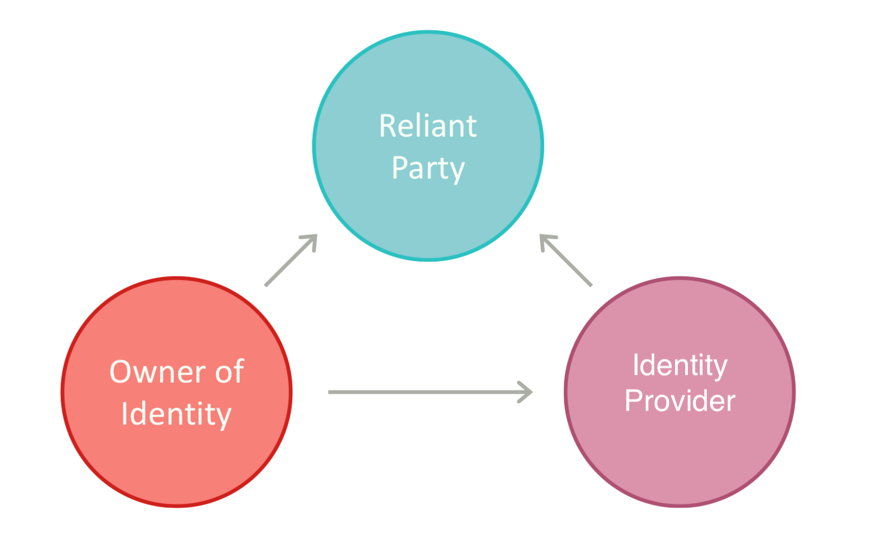

## Introduction
Built on top of OpenID and focused on customer privacy, this ***Digital Trust Protocol*** is a proposal for a new standard for verified data sharing services.
Sharing data occurs in many every day activities, when people and businesses interacts with third parties to benefit from many services they currently
offer.
By establishing a way to securely and trustily connecting identity owners, relying parties and identity providers, our aim is to simplify those interactions.

## What is this for?
Sharing Verified Data applies to many multiple use cases, not only when someone's identity needs to be verified. In general terms there are three main categories where the protocol could be applied:

- **Verify Identity**
  * At the customer’s request, the bank confirms the client’s name and other basic identifying information
- **Share Verified Data**
  * At the customer’s request, the bank shares and confirms extensive amounts of information
- **Validate Summary Facts**
  * At the customer’s request, the bank shares summary facts without disclosing private data. For example, this person is old enough to buy
alcohol – but the date of birth will not be disclosed

Some sample applications:

- Register with a service provider with minimum information shared
- Apply for a product and get best deal based on your profile characteristics
- Vetting process such as renting apartment or applying for a job
- Prove your age or nationality
- Improve your profile in any given matching platform
- Prove you can act on behalf of your company

### The Protocol at a glance

- Focused on Customer Privacy [Consent is a must]
- Built on top of OpenId Connect (OIDC)
- Incorporates Financial Institutions Security Best Practices
- Initially implementation for Authorization Code Flow
- Data Verification/Sharing happens during Authorization [IdToken Claims]
- Rich syntax allows complex claim assertions request
- Facilitates adoption for Relying Parties
- Facilitates implementation for Identity Providers / Data Verifiers
- Open Source specifications, client libraries and reference implementation
- Level of Assurance support [Based on eIDAS and NIST specifications]
- [Backlog] Proof of Verification support [Reference to Document, ZKP, Verifiable Credentials]
- [Backlog] Other flows to be supported such as CIBA and Device Authorization

